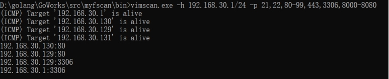
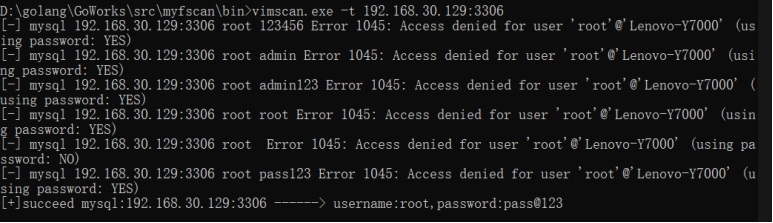

# InTScan

这是一个基于go语言的内网扫描器

开发时间有限，属于个人兴趣，有瑕疵还需包容；
支持协同拓展开发，避免重新造车轮子；
注意网络安全法则，本项目只用于学习使用！！！

使用方式：

HOST -h Host to be scanned,supports four formats:
	192.168.1.1
	192.168.1.0/24
PORT -p Customize port list，separate with ',' example:
	21,22,80-99,8000-8080 
Mysql_intruder -t IP:PORT example: 
	192.168.1.1:3306

输入需要扫描的内网地址段并输入需要扫描的端口集合

发现192.168.30.129开启了3306端口，尝试爆破MySQL数据库

